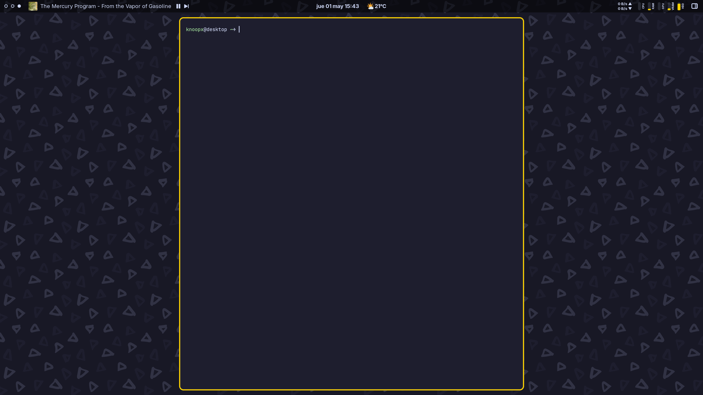

# Astal Shell



## Nix Flake Usage

This repository includes a Nix flake for easy packaging and development.

### Building

```bash
# Build the main shell
nix build .#default

# Build the greeter
nix build .#greeter
```

### Running

```bash
# Run the main shell
nix run .#default

# Run the greeter
nix run .#greeter
```

### Development

```bash
# Enter development shell with all AGS libraries
nix develop

# Or use direnv for automatic shell activation
echo "use flake" > .envrc
direnv allow
```

### Using in NixOS

You can use this flake in your NixOS configuration:

```nix
{
  inputs = {
    nixpkgs.url = "github:nixos/nixpkgs/nixos-unstable";
    astal-shell.url = "github:knoopx/ags";
  };

  outputs = { nixpkgs, astal-shell, ... }: {
    nixosConfigurations.yourhostname = nixpkgs.lib.nixosSystem {
      system = "x86_64-linux";
      modules = [
        # Your other modules
        ({ pkgs, ... }: {
          # Add the overlay
          nixpkgs.overlays = [ astal-shell.overlays.default ];

          # Install the packages
          environment.systemPackages = with pkgs; [
            astal-shell
            ags-greeter
          ];
        })
      ];
    };
  };
}
```

### Using with Home Manager

```nix
{ inputs, pkgs, ... }: {
  imports = [ inputs.ags.homeManagerModules.default ];

  programs.ags = {
    enable = true;
    configDir = null;  # Don't symlink since we're using the bundled version
    extraPackages = with pkgs; [
      inputs.astal-shell.packages.${pkgs.system}.default
    ];
  };
}
```

# References/Credits

- https://aylur.github.io/astal/guide/typescript/widget
- https://aylur.github.io/libastal/astal3/index.html#classes
- https://docs.gtk.org/gtk3/#classes
- https://gitlab.gnome.org/GNOME/gtk/-/blob/gtk-3-22/gtk/theme/Adwaita/_colors-public.scss
- https://github.com/AymanLyesri/ArchEclipse/


# TODO

* replace setTimeout with GLib.timeout_add